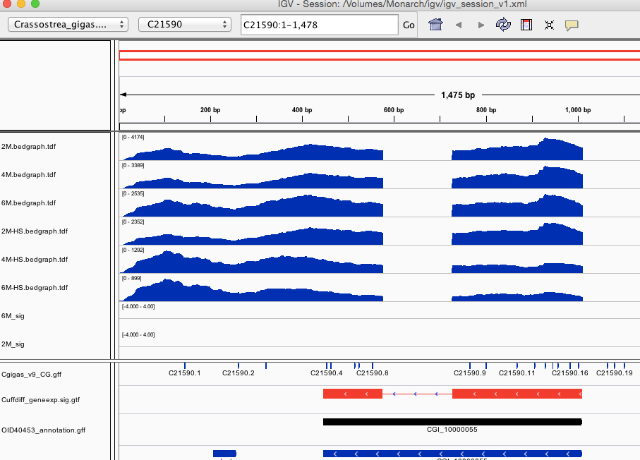
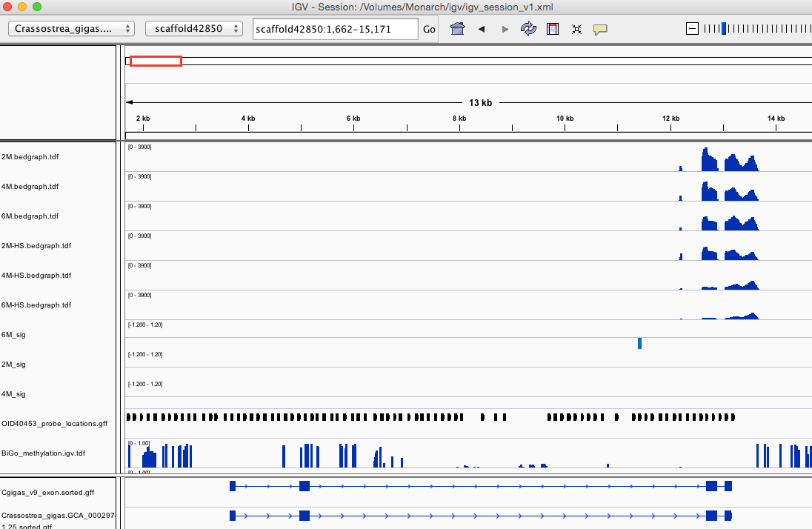
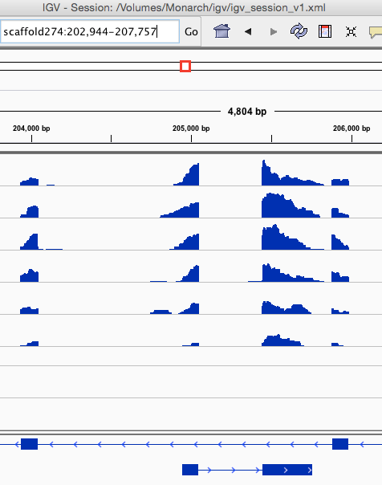
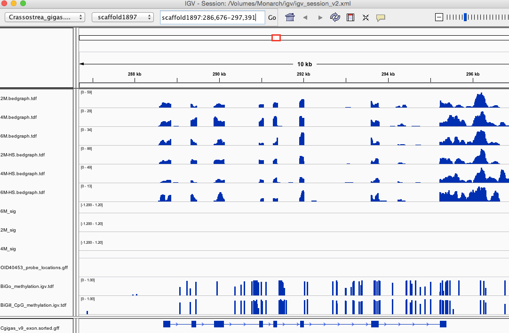
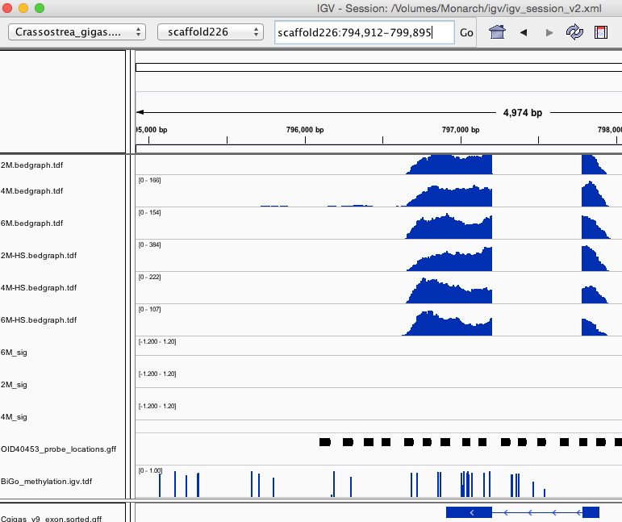

# Histone Variants 


	CGI_10000055	P84245	3.00E-90	Histone H3.3    
	CGI_10007918	P84245	4.00E-71	Histone H3.3    
	CGI_10017020	P84245	3.00E-90	Histone H3.3    

**CGI_10000055**

tl;dr Differentially expressed with temp stress - no methylation


---

**CGI_10007918**

tl;dr Expression, temp hypomethylation in 1 ind


---

**CGI_10017020**     
tl:dr Expression


---

```
CGI_10020921	O93327	1.00E-99	Core histone macro-H2A.1
```

	
---

`CGI_10025376	Q7ZUY3	8.00E-49	Histone H2A.x`


	
	
	
	